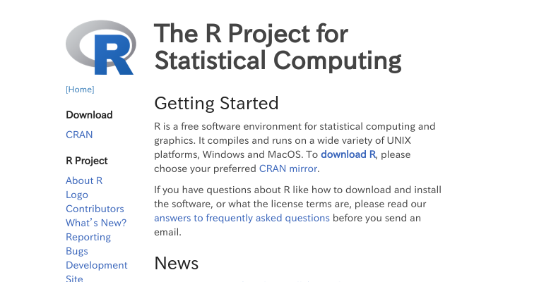

```{r setup, include=FALSE}
knitr::opts_chunk$set(echo = TRUE)
```

## Rのインストール {.tabset}

各プラットフォームで微妙に異なりますので，各種プラットフォームで紹介します。なおこれは2017/06/13現在でのもので，R3.4.0を念頭に置いています。

### Windown

#### RをCRANからインストール

1. ブラウザで「r」で検索
1. (おそらく)トップに出てくる「R: The R Project for Statistical Computing」(https://www.r-project.org/)へアクセス

1. 左の「CRAN」をクリック
1. **0-Cloud**，もしくは近い場所をクリック
1. 

### Mac

### Ubuntu

## RStudioのインストール

### Windows

### Mac

### Ubuntu

## RStudio Serverの利用