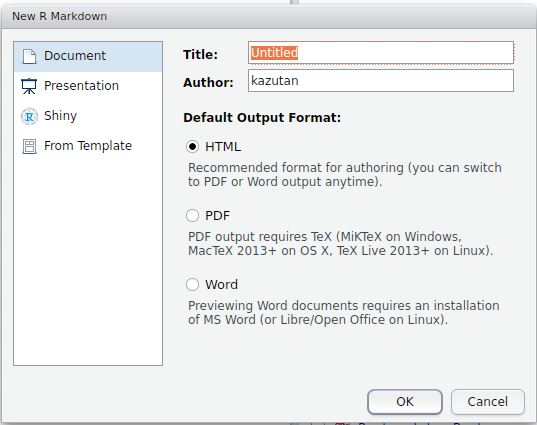
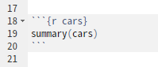
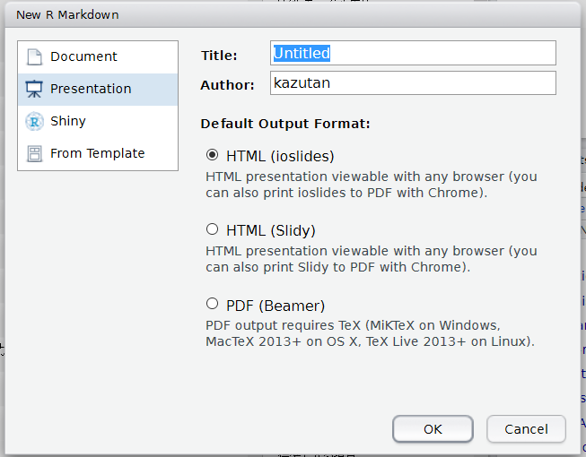

```{r setup, include=FALSE}
knitr::opts_chunk$set(echo = TRUE)
library(DiagrammeR)
```

## はじめに

### 今回の内容

- R Markdownとは
    - 仕組みを簡単に紹介します
- Markdown記法
    - 必要最低限の説明をします
- R Markdownでドキュメント生成
    - 実際にファイルを使って説明します
- R Markdownでスライド生成
    - 実際にファイルを使って作ってみます

### 留意事項

このドキュメントはR Markdownの初心者を想定しています。なので基本的な内容を中心に構成しています。なおRのコードは必要最低限しか出てきません。なおこれは過去にスライド形式で発表したRmdファイルをほぼそのままドキュメントとして出力しています。そのためほぼ箇条書きで書いています。

実行環境は,[about](about.html)を参照してください。


## R Markdownとは

### Rでドキュメント生成

- Rはデータ解析
- 実はRでドキュメントを生成することが可能
    - R Markdownを利用
    - その便利さ、その将来性に注目が
- 今日はR Markdownによるドキュメントやスライド生成をご紹介

### Rでやるメリット

- 分析からレポート生成までが完結
    - WordもExcelも(そしてぱわぽも)いらない
    - コピペ汚染からの開放
- 再現性の確保
    - 同一の内容をそのまま再現できる
- 再利用、配布が簡単
    - コードを簡単に再利用可能
    - テキストデータなので運用が簡単
- 作るのが簡単
    - ドキュメント部分は基本Markdown
- and more!!

### R Markdownの基本的な仕組み

- 以下の2ステップでドキュメントなどを生成します
    - Rmdファイル内のRコードを評価
    - Rコードの出力をMarkdownに起こす
    - 出来上がったMarkdownファイルを変換
        - Pandocというソフトウェアを利用
        - RStudioに標準で組み込まれています

```{dot, echo=FALSE}
digraph knit {
  graph [
    label = "R Markdownの大まかな流れ",
    rankdir = LR,
    layout = dot,
    dpi = 450, 
  ]
  
  node [
    style = "solid, filled",
    fillcolor = Purple1,
    label = ".Rmd"
  ]
  A;
  
  node [
    style = "solid, filled",
    fillcolor = Violet,
    label = ".md",
  ]
  B;
  
  node [
    style = "solid, filled",
    fillcolor = LightBlue,
  ]
  C [label = "html, docs, pdf..."];

  A -> B [label = "knit"]
  B -> C [label = "Pandoc"]
  
}
```

### ワークフロー

1. R Markdownファイル(hoge.Rmd)を準備
2. 中身を記述
3. レンダリング(Knit)して出力を確認
4. 2と3を繰り返す
5. 完成

- 正直なところ，まずは**Markdownが書けて，Rチャンク(後述)を作れればOK**です
    - 様々な機能や設定は大量にありますが，デフォルトでも十分使えます
    - まずは早速使ってみましょう

### はじめてのR Markdown

<div class="column1">
1. Rmdファイルを作成
    - RStudioを起動
    - 画面左上のボタンから**R Markdown...**をクリック
</div>
<div class="column2">

</div>

***

<div class="column1">
2. 初期設定
    - Title: ドキュメントのタイトル
    - Author: 著者名
    - Output Format: ファイル形式
</div>
<div class="column2">

</div>

***

ファイルが作成され，自動で開きます:


***
<div class="column1">
3. Knitする
    - window上部の**Knit**ボタンをクリック
    - Rmdファイルのファイルを保存するダイアログボックスが表示
    - 保存したら実行されます
</div>
<div class="column2">

</div>

***

レンダリングが終了すると，自動的に`.html`ファイルが作成され，Viewerに表示されます:


### ワークフローの確認

1. R Markdownファイル(hoge.Rmd)を準備
2. 中身を記述
3. レンダリング(Knit)して出力を確認
4. 2と3を繰り返す
5. 完成

- というわけで，1と3の基本はこれでOKです
- 次に，中身の作り方を説明します

## Markdown記法

### Markdown(md)とは

- 文書を記述するための軽量マークアップ言語のひとつ
    - ドキュメント構造の基本的なものを提供
    - R Markdownはこれで文書を作ります
- mdには色々な"方言"が
    - RmdはPandoc Markdownです
- RStudioにはクイックリファレンスが
    - [Help] - [Markdown Quick Reference]
    - これみとけばOK

### 見出し(h1-h4)

<div class="column1">
- 文書構造を明確にするためにも、きっちり割り振る
    - レベル1は通常文書タイトル(章クラス)
    - レベル2は通常節クラス
    - 以下準じて下がっていく
- 極力見出しの前後は空行をいれとくといいです
</div>
<div class="column2">
```
# レベル1(h1)
## レベル2(h2)
### レベル3(h3)
#### レベル4(h4)
```
</div>

### 段落(p)と強制改行(br)

```
「もうすこしだ！　この山を越えると、梅の林がある。――疾く参って梅林の木陰に憩い、思うさま梅の実みをとれ。――梅の実をたたき落して喰え」

　聞くと、奄々と渇にくるしんでいた兵も、  
「梅でもいい！」  
「梅ばやしまで頑張れ」と、にわかに勇気づいた。

　そして無意識のうちに、梅の酸っぱい味を想像し、口中に唾をわかせて、渇を忘れてしまっていた。

　――梅酸渇を医す。
```

- 上下に空行を挟むと、そこを段落ブロック(p)として認識
- 行末に半角スペース2つ以上いれると強制改行(br)

### 番号なし箇条書き(ul>li)

<div class="column1">
```
- 箇条書き1
    - 箇条書き1-1
- 箇条書き2
    * 箇条書き2-1
    * 箇条書き2-2
```
</div>
<div class="column2">
- 記号とスペースの後に内容を記述
    - どちらでもOK
    - 行頭の空白4つで1レベル下がる
</div>

### 番号あり箇条書き(ol>li)

<div class="column1">
```
1. 番号1
    1. 番号1-1
2. 番号2
    1. 番号2-1
    2. 番号2-2
```
</div>
<div class="column2">
- 番号とピリオドとスペースの後に内容を記述
    - 行頭の空白4つで1レベル下がる
</div>

### コードブロック(pre>code)

<div class="column1">
- 入力した内容がそのまま表示されます
    - Rのコードは評価されません
</div>
<div class="column2">

````
```
(ここにコード記述)
```
````

</div>


### 強調表示

<div class="column1">
- 左のとおりです
- 強調具合などはCSSなどに依存します
</div>
<div class="column2">
```
*斜体*、もひとつ_斜体_
**太字**、もひとつ__太字__
```
</div>

### リンク、画像

<div class="column1">
```
- http://blog.kz-md.net/
- [リンク文字](http://blog.kz-me.net/)


```
</div>
<div class="column2">

- 基本、相対パスや絶対パスの両方OK
- URLでもOK
</div>

### その他

- 以下の内容もいけます
    - コードブロック
    - 引用
    - 脚注
    - Latex数式
    - 表
    - 水平線　etc...
- Pandoc Markdownなら大抵OKです
- その他，htmlタグ直打ちでもOKです
    - ただし，出力フォーマットがhtmlのみ

## R Markdownの書き方

### Markdownとの違い

- Markdownに**Rのコードを評価するブロック(Rチャンク)**と**ドキュメント設定用のYAMLヘッダ**を組み込めるようにしたもの
    - 拡張子は**.Rmd**
    - Markdownの基礎があれば、Rチャンクを少し勉強すれば利用可能
- RStudioを使うと抜群に楽になる
    - 専用の便利機能がたくさん
    - すぐに内容を確認(Preview)できる
    - 補完機能も充実

### 対応する出力形式

- いろんなものに対応しています(一部抜粋)
    - htmlファイル
        - 基本かつ**最強**。最もRmdを活かせるタイプ。
    - pdfファイル
        - tex環境が必要。いくつか地雷があるけど整えれば楽しい。
    - docxファイル
        - Officeをインストールしてなくても生成可能。
    - odtファイル
        - LibreOfficeなどで利用可能。
    - mdファイル
        - Githubやブログ記事向け。
    - rtfファイル
        - リッチテキスト形式。
    - その他いろいろ

### なにから手を付けるべき?

- まずはMarkdownに慣れる
    - 慣れないうちはQuick Referenceをみましょう
- Rチャンクに慣れる
    - いろんなコードを実行してKnitする
    - 基本的なチャンクオプションをおぼえる
- YAMLヘッダに慣れる
    - YAMLの書き方に慣れる
    - 基本的なオプションをおぼえる

これでOK。

## Rチャンク(chunk)の基本

### Rチャンクとは

- Rのコードを記述したブロック
    - 基本的な書き方は以下の通り
````
`r ''````{r}
head(iris)
`r ''````
````
    - ちなみに実行結果は以下の通り:

```{r r-chank-sample, eval=TRUE, echo=FALSE}
head(iris)
```

***

キャプチャするとこんな感じ:

<div class="column1">

</div>
<div class="column2">

</div>

### Rチャンクの基本

- Rチャンクはいくつでも設置可
    - チャンクに名前をつけることも可能
    - 結構詳細にオプションを設定可能
    - Rオブジェクトを引き継ぐことも可能
- 通常と(ほぼ)同じようにRが使える
    - パッケージ読み込みやファイルへのアクセス
- コードのみを実行可能
    - コードのみを実行すると`Global Envirnment`に
    - Knitした場合，別のEnvironmentで実行される
    - cacheしておくことも可能(今回は省略)

### Rチャンク オプション

- そのRチャンクでの設定を記述
    - 設定項目はたくさんある
    - そのあたりはリファレンスを参照
    - 以下、絶対覚えるべきものだけ紹介

````
`r ''````{r chank-name, eval=TRUE}
head(iris)
`r ''````
````

### echo(コード部の表示・非表示)

- Rのチャンクコードを表示させるかどうか
    - `echo=FALSE`で非表示
    - あくまで表示に関することだけ
    - コード評価をするかどうかは影響しない

````
`r ''````{r, echo=FALSE}
head(iris)
`r ''````
````

### eval(コード部の評価・非評価)

- Rチャンクのコードを評価するかしないか
    - `eval=FALSE`で非評価

````
`r ''````{r, eval=FALSE}
head(iris)
`r ''````
````

### include(レポートに組み込むか否か)

- Rチャンクをレポートに組み込むかどうか
    - `include=FALSE`でレポートから除外
    - でもコードは評価されます
    - セットアップとか前処理とかパッケージ読み込みとかで重宝

````
`r ''````{r, include=FALSE}
library(zousan)
`r ''````
````

## yamlヘッダ

### yamlヘッダの基本

<div class="column1">
- ドキュメントの全体的な設定など記述
- yaml記法で記述
    - 左のスペース、重要
    - 多分感覚をつかむまでは、見様見真似でやっていったほうがいいです
</div>
<div class="column2">
```
---
title: "Untitled"
author: "kazutan"
date: "2017年2月17日"
output: html_document
---
```

### 標準で入る項目

<div class="column1">
- `Title: `はドキュメントのタイトル
- `author: `は名前
- `date: `は日にち
- `output: `は出力形式に関して
    - ここで出力を指定・設定
    - まずはここでいろいろ試しましょう
</div>
<div class="column2">
```
---
title: "Untitled"
author: "kazutan"
date: "2017年2月17日"
output: html_document
---
```
</div>

### 練習: tocを有効にする

<div class="column1">
- Rmdファイルを新規作成
- 冒頭のyamlヘッダを編集
    - output部分を右のように変更
    - スペース2個分で段差をつける
- knitして出力されたファイルを確認
</div>
<div class="column2">
```
---
(省略)
output:
  html_document:
    toc: true
---
```
</div>

### 練習: floating tocを有効にする

<div class="column1">
- 冒頭のyamlヘッダを編集
    - output部分を右のように変更
- knitして出力されたファイルを確認
</div>
<div class="column2">
```
---
(省略)
output:
  html_document:
    toc: true
    toc_float: true
---
```
</div>

### toc関連の設定項目

<div class="column1">
- toc: 見出しリスト作成。論理値。
- toc_depth: tocで拾ってくる見出しレベルの指定。数値。
- toc_float: tocをサイドメニューとして浮かせて表示させるか。論理値
- number_section: 見出しに通し番号を自動付与させるか。論理値。
</div>
<div class="column2">
```
---
(省略)
output:
  html_document:
    toc: true
    toc_depth: 2
    toc_float: true
    number_section: true
---
```
</div>

### 出力まわり

<div class="column1">
- keep_md: knitした時に途中で作成されるMarkdownをファイルとして残すかどうか。論理値。
- self_contained: 出力されるhtmlファイルに、画像やcssファイル、あるいはjsファイルなどを組み込んでしまい、htmlファイル単独でも表示できるようにするか。論理値。
</div>
<div class="column2">
```
---
(省略)
output:
  html_document:
    keep_md: true
    self_contained: true
---
```
</div>

<div class="column1">
- md_extentions: Pandoc Markdown拡張で追加and/or削除する要素を指定。
    - 日本語見出しを使う場合、重要になります
- pandoc_args: Pandocに送る引数を指定。
    - revealjsスライドを使う場合、重要になります
</div>
<div class="column2">
```
---
(省略)
output:
  html_document:
    md_extentions: NULL
    pandoc_args: NULL
---
```
</div>

### その他の設定項目について

- html_documentで使える項目一覧は以下にまとめました:
    - [R Markdownのhtml_documentで指定できるyamlヘッダ項目について](http://qiita.com/kazutan/items/726e03dfcef1615ae999)
- その他、以下の資料を参考にしてください:
    - [R Markdownチートシート(日本語版, pdf)](https://www.rstudio.com/wp-content/uploads/2016/11/Rmarkdown-cheatsheet-2.0_ja.pdf)
    - [R Markdownのhtml documentの解説ページ](http://rmarkdown.rstudio.com/html_document_format.html)


## R Markdownでスライド生成

### なぜR Markdownでスライドを作るのか?

- 先述したドキュメント生成のメリットは共通
- スライドはアウトラインから起こすと作りやすい
    - セクション、各スライドタイトル、コンテンツで構成
    - シンプルなルールがそのまま適用できる
- レイアウトやテーマ要素をいちいち考えなくていい
    - ごてごてしたレイアウト、本当に必要?
    - テーマはスライドで共通してるから全体設定すればOK

### スライド作成のバリエーション

- R Presentation
    - RStudioに組み込まれたものでreveal.jsがベース
    - **現状あまりおすすめしにくい**
- ioslides
    - rmarkdown標準で組み込み。結構きれい
- slidy
    - rmarkdown標準で組み込み。いまいち
- beamer
    - てふにしゃん御用達でpdfファイル形式
- {revealjs}パッケージ
    - 多機能、デザイン豊富、カスタマイズしやすい
    - このスライドもこれで作ってます

### Rmdでスライドを作るには

以下のワークフローで進めます:

1. スライド用のRmdファイルを新規で作成
2. 内容を編集
3. knitして確認
4. 2と3を繰り返す
5. 完成

ほぼドキュメントのときと違いませんが、どれで作るかによって1と2が変化してきます

### ioslidesでスライド作成

1. R Markdownファイルをダイアログボックスから作成
    - **Presentation**に切り替える
    - **ioslides(HTML)**を選択してOK



2. 内容を編集して**Knit**を実行
3. こういうスライドができあがります


### ioslidesの使い方

- スライド区切り
    - 見出しレベル2`##`が各スライドのタイトル
        - レベル3以下はスライド内部の見出しとして処理
    - 見出しなしでのスライド区切りは`---`で
- セクション区切り
    - 見出しレベル1`#`の見出しがセクション区切り
    - スライド内コンテンツを入れても表示される
- いろんな機能がありますので、以下を参照してください
    - [Presentations with ioslides](http://rmarkdown.rstudio.com/ioslides_presentation_format.html)

### revealjsパッケージで作成

1. パッケージをインストール

```{r, eval=FALSE}
# CRANから
install.packages("revealjs")
# GitHubから
devtools::install_github("rstudio/revealjs")
# githubinstallパッケージでもok
githubinstall::githubinstall("revealjs")
```

***

2. R Markdownファイルをダイアログボックスから作成
    - **From Template**に切り替える
    - **revealjs Presentation**を選択してOK


3. 内部を編集して**Knit**を実行
4. こういうスライドができあがります


### revealjsの使い方

- 水平スライド遷移のみ(1Dスライド)
    - 見出しレベル2`##`でスライド区切り
    - レベル1`#`は**使用しないこと**
    - タイトル無しスライド区切りは`---`
- 水平･垂直スライド遷移(2Dスライド)
    - 見出しレベル1がセクション区切り
    - 見出しレベル2がスライド区切り
    - 同一セクションが縦に連なり、セクションが移る際右へ
    - セクション見出しのスライドはタイトルのみ
        - 何か書くと垂直が機能しなくなります

<div class="column1">
- テーマ切り替え
    - yamlヘッダを編集
    - 使えるのは"default", "simple", "sky", "beige", "serif", "solarized", "blood", "moon", "night", "black", "league", "white"
</div>
<div class="column2">
```
---
output:
  revealjs::revealjs_presentation:
    theme: sky
---
```
</div>

<div class="column1">
- cssによる設定
    - cssファイルを準備
    - yamlヘッダを編集
    - cssのセレクタについては、実際のhtmlを見てみるのが速い
    - 楽したい方は[こちら](http://qiita.com/kazutan/items/017bcdf5f9beedc170f1)に近い情報あり
</div>
<div class="column2">
```
---
output:
  revealjs::revealjs_presentation:
    css: style.css
---
```
</div>

- その他、いろんなことができます
    - 詳しくは本家のドキュメントを参照してください
    - https://github.com/rstudio/revealjs
- ほぼ内容かぶりますが、昔まとめたのがこちらです
    - https://kazutan.github.io/SappoRoR6/rmd_slide.html
- あるいは、Twitterなどで私に直接聞いてください

## FAQ

### スライドが戻る(進まない)

- 見出しがかぶるとこういう症状が発生します
    - htmlの{#id}が自動生成されるときに重複するため
    - これはPandocによる変換のときに付与されています
        - この自動付与のルールについては、Pandoc Markdownの仕様を確認してください
- **日本語&半角英数字の見出しだと、半角英数字がかぶるだけで発生**
    - {rmarkdown}がPandocに送る[デフォルト設定](http://qiita.com/kazutan/items/eb15a42607f87f57b525)の仕様です
    - 正直つらい

- 回避策
    - htmlドキュメントの場合、以下のおまじないを入れておいてください
    ```
    ---
    output:
      html_document:
        md_extensions: -ascii_identifiers
    ---
    ```
    - revealjsの場合は以下のようにしてください
    ```
    ---
    output:
      revealjs::revealjs_presentation:
        pandoc_args: [
      '--from', 'markdown+autolink_bare_uris+tex_math_single_backslash-implicit_figures'
    ]
    ---
    ```
    - それでもうまくいかないときは、見出しを変更するか、以下のように`#idを手動で付与してください
    ```
    # ほげほげ{#hogehoge}
    ```

### スライドの縦が足りない

- まずは1枚に収まるように内容を再考しましょう
    - **その内容は本当に必要ですか?
- どうしても必要なら…
    - 適当なところで`---`を差し込んで複数に分ける
    - slidyを使う

### 動的なコンテンツがおかしい

- htmlで出力してくるものが{revealjs}などのcssと干渉してくるため
- 以下のおまじないをsetupチャンクに仕込んでください
```
knit_print.htmlwidget <- function (widget, ..., options = NULL)
{
    file <- basename(tempfile(fileext = ".html"))
    selfcontained <- if(is.null(rmarkdown::metadata$self_contained)) TRUE else rmarkdown::metadata$self_contained
    htmlwidgets::saveWidget(widget, file = file, selfcontained = selfcontained)
    content <- if (selfcontained) {
        on.exit(unlink(file), add = TRUE)
        list(srcdoc = paste(readLines(file), collapse = "\n")) 
    }
    else {
        list(src = file)
    }
    x <- htmltools::tag("iframe", content)
    knitr::knit_print(x, options = options, ...)
}
```

### ○○を追加したい!

- 基本、html上で実現可能なものならすべて対応できます
    - Rmd(というかmd)はhtml直打ちに対応
- html_documentはjQueryとbootstrapを組み込んでる
    - これらで実現できることならわりと簡単にできる
- 面倒だったら、直接私に聞いてください

### インタラクティブな要素を組み込みたい

- RにはShinyがあります
    - langtestはshinyです
    - 詳しくはshinyマスターへご相談ください

### PythonでR Markdownみたいなのないの?

- 私の知る限り、ここまでのものは現在ありません
    - でも**R Markdown上でPythonを実行できます**
    - 詳しくは以下を参照してください
    - http://rmarkdown.rstudio.com/authoring_knitr_engines.html

### デフォルトで入ってくる文字列うざい

- Rmdのテンプレートを自作する方法が
    - 詳しくは本家ドキュメントを
    - ただし、Pandocの知識が必要
= 面倒だったら、`zousan::new_rmd_ja()`を
    - 自分用に作りました
    - ただし、急に仕様変更使用することがあるので注意

### チャンクを入れるのがめんどくさい

- チャンクを入れるボタンがあります
- キーボードショートカットを活用
    - Ctrl/Cmd + Alt + I
- Knitにもキーボードショートカットあります
    - Ctrl/Cmd + Shift + K
- チャンク内コードを実行するショートカットも
    - Ctrl/Cmd + Shift + Enter

### Windowsだと文字化けしたりする


## 次のステップに進むには?

### まずはhtml_documentになれる

- これが一番の基本です
    - 公式ドキュメントを一度見てください
    - http://rmarkdown.rstudio.com/html_document_format.html
- チャンクオプションやyamlについてはよく使うのをおさえればOK
    - わからなくなったら、RStudioのヘルプメニューへ
        - R Markdown CheatSheatが便利です
        - R Markdown Reference Guideもいい感じです

### Pandocについて調べる

- R MarkdownはPandocを使ってmdを変換
    - よくも悪くもPandocの仕様が大きく影響
    - 文量が多いですが、以下を読むとかなり理解が進みます
    - http://sky-y.github.io/site-pandoc-jp/users-guide/
        - 実際、私はよくここでトラブルの解決策を探してます

### CSSとJavascriptを勉強する

- htmlドキュメントはcssで書式設定
    - cssが使えるようになれば自由自在
    - Bootstrapが標準で組み込まれている
        - あわせてこちらもチェックするとより便利に
- jsが使えると幅が広がる
    - 動的なものも作れるように
    - jQueryが標準で組み込まれている
        - あわせてこちらもチェックするとよりすごいことが

### いろんな出力フォーマットを試す

- docxドキュメントやpdf(tex)にも対応
- Webサイト構築も
- Blogも作れる
- 電子書籍も作れる

**Enjoy!**