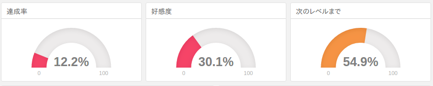
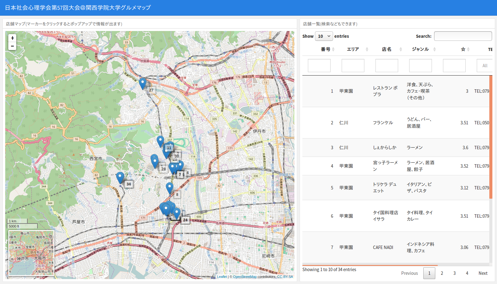
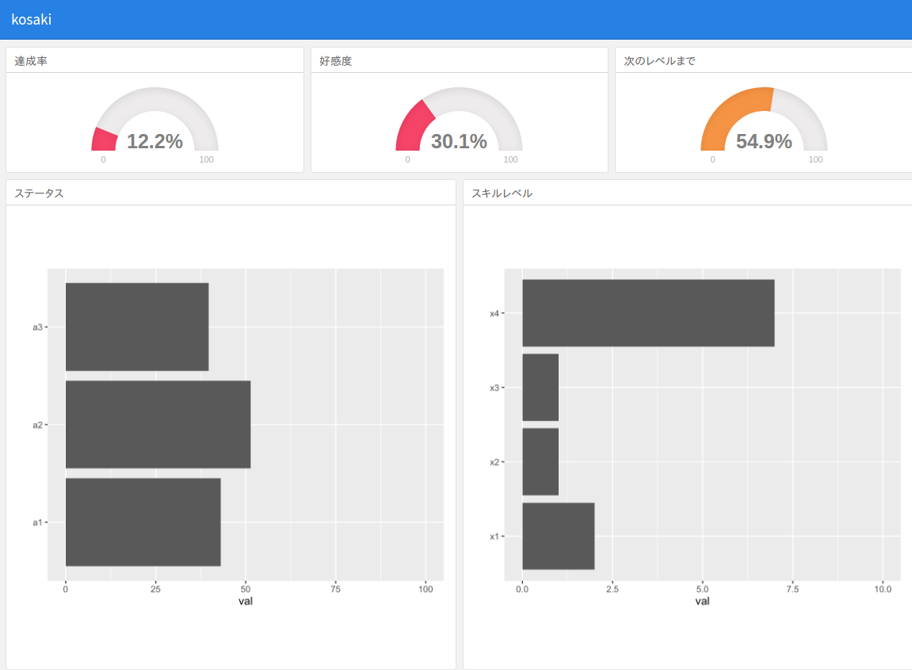

```{r setup, include=FALSE}
knitr::opts_chunk$set(echo = TRUE)
```

このドキュメントはR Markdownの初心者を想定しています。なので基本的な内容を中心に構成しています。なおRのコードは必要最低限しか出てきません。なおこれは過去にスライド形式で発表したRmdファイルをほぼそのままドキュメントとして出力しています。そのためほぼ箇条書きで書いています。

## ダッシュボードとは?

- 色々な情報をぱっと見で理解できるように集約したもの
    - 車の運転席のダッシュボードをイメージしてもらえれば
    - グラフや表，文字などをわかりやすく配置
- データを集約して表示するのに便利
    - あるトピックについて，様々な角度から可視化
    - 相手に情報を伝えやすい!

## flexdashboardパッケージ

- R Markdownの拡張パッケージ
    - **Rmdファイル単体で**ダッシュボードを作成可能
- レイアウトが簡単
    - row(行)とcolumn(列)によるレイアウトシステム
    - モバイル対応(フレキシブルデザイン)
- レイアウト設定以外は通常のRmd
    - 動的なコンテンツ(htmlwidgets系)も作成可能
    - shinyもOK

## 使ってみよう {#howtoFdb}

### flexdashboardのインストール
- CRANから
```{r, eval=FALSE}
install.packages("flexdashboard")
```
- GitHub版から
```{r, eval=FALSE}
devtools::install_github("rstudio/flexdashboard")
```
- githubinstallから
```{r, eval=FALSE}
githubinstall::githubinstall("flexdashboard")
```

### テンプレートからRmdファイル生成

- R Markdownを新規作成
- "From Template"を選択
- "Flex Dashboard"を選択
- OKをクリック


こんなRmdができます:


そのままknitするとこうなります:


## 冒頭のyamlについて

```
title: "Untitled"
output: 
  flexdashboard::flex_dashboard:
    orientation: columns
    vertical_layout: fill
```

- title: ページのタイトル(navbarにあるやつ)
- orientation: **列方向(columns)**で区切るか**行方向(rows)**で区切るか
    - **見出し要素Lv2**の方向を決定します
- vertical_layout: グラフを範囲内に収める("fill")かスクロール("scroll")するか
- social: 要するに"共有"ボタンをつけるかどうか

他にもありますが，`?flexdashboard::flex_dashboard`でヘルプを参照してください

## レイアウトと見出しレベルについて

### 見出しレベル1: ページ区切り

- 見出しレベル1(h1)があると，ページ区切りとして機能
    - 公式やサンプルでは`====`を使った方法で解説
    ```
    ページタイトル
    ====
    ```
    - でもいつもの`#`でもOK
    ```
    # ページタイトル
    ```
- この文字は**表示されません**
    - 識別用に利用されます

### 見出しレベル2: 親ブロックの区切り

- 見出しレベル2(h2)があると，その数だけページ内を区切ります
    - 公式やサンプルでは`----`を使った方法で解説
    ```
    ブロック
    ----
    ```
    - でもいつもの`##`でもOK
    ```
    ## ブロック
    ```
- この文字は**表示されません**
    - 識別用に利用されます

### 見出しレベル3: 親ブロック内の子ブロック

- 見出しレベル3(h3)があると，その親ブロック内で子ブロックを作成します
    - いつも通り`###`で作ります
    ```
    ### ちゃーと
    ```
    - この中にRチャンクを挿入して中身を作成
    - 親ブロック内に子ブロックが複数あると**親と逆の方向で区切ります**
- この文字は**表示されます**

## タブセットの利用

- 親ブロック(見出しレベル2)内でタブを設定可能
    - 子ブロック要素が各タブの内容となります
    
    ```
    ## 親ブロック {.tabset}
    
    ### 子ブロック1
    (ここにRチャンクなど)

    ### 子ブロック2
    (ここにRチャンクなど)
    ```

## その他のレイアウト関連

- 他にも色んなパターンができます
    - 区切り幅(高さ)の調整
    - サイドバーを表示
    - ストーリボード
- 詳しくは，以下の本家のサイトを参照してください
    - [Sample flexdashboard Layouts](http://rmarkdown.rstudio.com/flexdashboard/layouts.html)

## Components

- [ValueBoxes](http://rmarkdown.rstudio.com/flexdashboard/using.html#value_boxes): 単一の値をシンプルに示したい時に
    
- [gauge](http://rmarkdown.rstudio.com/flexdashboard/using.html#gauges): ゲージをさっくりと作ることも可能
    
- 詳細およびその他の要素は本家のサイトを参照
    - [Using flexdashboard#components](http://rmarkdown.rstudio.com/flexdashboard/using.html#components)

## 活用例

過去に私が作ったダッシュボードの例を参考までに。

### 活用例: グルメマップ
- 学会に参加**できなかった**から作りました
    - 実際のダッシュボードは[こちら](http://kz-md.net/stat/tmp_box/sp2016_map_dashboard.html)
    - Rmdのコードは[こちら](http://kz-md.net/stat/tmp_box/sp2016_map_dashboard.Rmd) (データはありません)
    

### 活用例: 台風プロット
- 気付いたら作るようになってた
    - 実際のダッシュボードは[こちら](http://kz-md.net/stat/tmp_box/2016typhoon2.html)
    - Rmdのコードは[こちら](http://kz-md.net/stat/tmp_box/2016typhoon2.Rmd) (データはありません)
    

### 活用例: 個人別ダッシュボード

- 「あるデータセットから，個人別のダッシュボードをまとめて作りたい」
    - R Markdownのパラメータ機能をうまく利用すれば可能
    - 詳細は以下を参照  
    [R Markdownのparams機能を利用してflexdashboard作成](https://github.com/kazutan/param_dashboard)



## 参考資料 {#ref-fdb}

- [flexdashboard: Easy interactive dashboards for R](http://rmarkdown.rstudio.com/flexdashboard/)
    - 本家のWebサイト
    - たぶんまともな情報はここくらいにしかない
    - あとはソースコードとヘルプを読むくらいしか…
- [flexdashboard Examples](http://rmarkdown.rstudio.com/flexdashboard/examples.html)
    - サンプルがギャラリーになってます
    - ソースコードも(いくつかは)確認できます
        - 各ギャラリーをクリックして表示
        - 画面右上の"</>Source Code"をクリック
    - Pokemonすげぇ


**Enjoy!**
